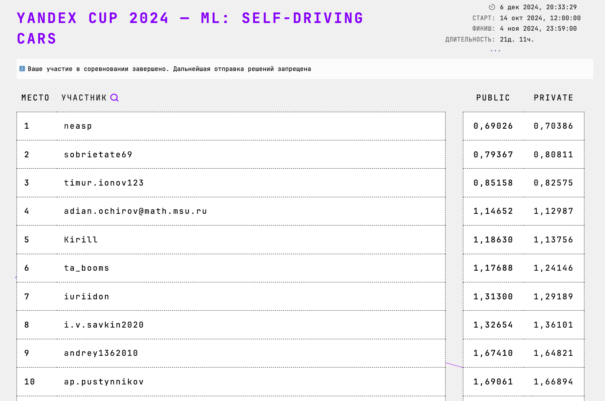

# Yandex cup 2024 self-driving

## [3rd place out of 143](https://contest.yandex.ru/contest/69013/standings/?p=1)


[Presentation](https://github.com/sir-timio/ya_cup_24/blob/main/YandexCup%20(1).pptx) 


## Task
Task is to simulate the vehicle's trajectory based on control commands (acceleration, steering) and  past .

## Metric
As a first step, all predicted triples $(x,y,yaw)$ are being converted into 2 points $[(x_1, y_1), (x_2, y_2)]$ in the following way:
$$
(x_1, y_1) = (x, y), \\
(x_2, y_2) = (x_1, y_1) + S \times (yaw_x, yaw_y)
$$  

where $S = 1$. In other words, we build a directed segment of length $1$. These points then used in the metric calculation.


Metric for a single pose (rmse):

$$
pose\_metric = \sqrt{ \frac{\displaystyle\sum_{j=1}^{k} {(x_j-\hat{x_j})^2 + (y_j-\hat{y_j})^2}}{k} }
$$

where $k$ - number of points that describe single pose (in our case $k=2$).


## Solution:
Encoder-Decoder architecture based on LSTM and Luong Attention and . Two separated encoders for control and trajectory sequences, one decoder predicting trajectory base.


## Train
(Actually, you don't have to train all models. 2-3 well trained models models (1700~ epochs)  with validaion metric about 1.1-1.05 will give 0.9~ at leaderboard).
(One well fitted model with 2500 epochs and 1.0 +- 0.005 validaion metric will give 0.97-1.03~)

### Put unzipped dataset into '..' directory

```
cd ..

unzip YandexCup2024v2.zip

cd YandexCup2024v2

tar -xvzf YaCupTest.tar.gz
tar -xvzf YaCupTrain.tar.gz

cd cup
```

### Run training:

```
sh fit_run.sh
```

### Merge predicitions:

```
python merge_predictions.py
```

result - '../submissions/all_trained_merge.csv.gz'

## Just inference
### unzip 'solution' dir
```
cd ..
unzip solution.zip
cd cup
```

### run inference.py
(paths are hardcoded in python script)
```
python inference.py
```


### Hardware prerequirements:
- NVIDIA A40 NVIDIA-SMI 525.147.05   Driver Version: 525.147.05   CUDA Version: 12.0 
- Linux  x86_64 x86_64 x86_64 GNU/Linux
- Python 3.10.8

```
NAME="Ubuntu"
VERSION="18.04.6 LTS (Bionic Beaver)"
ID=ubuntu
ID_LIKE=debian
PRETTY_NAME="Ubuntu 18.04.6 LTS"
VERSION_ID="18.04"
HOME_URL="https://www.ubuntu.com/"
SUPPORT_URL="https://help.ubuntu.com/"
BUG_REPORT_URL="https://bugs.launchpad.net/ubuntu/"
PRIVACY_POLICY_URL="https://www.ubuntu.com/legal/terms-and-policies/privacy-policy"
VERSION_CODENAME=bionic
UBUNTU_CODENAME=bionic
```
